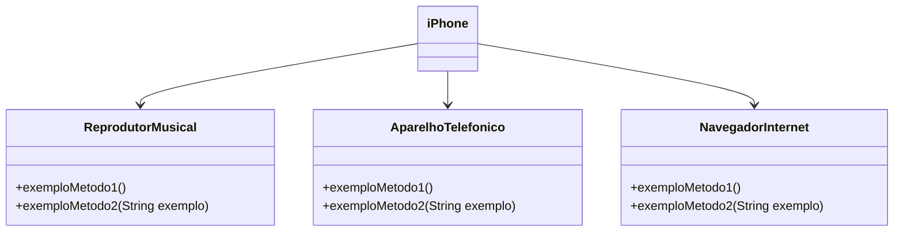

# DIO- Santander Bootcamp Fullstack Java+Angular

#### Autores
- [Gleyson Sampaio](https://github.com/glysns)

## Modelagem e Diagramação de um Componente iPhone  - Desafio (POO Básico)

Modelar e diagramar a representação UML do componente iPhone, elaborando a diagramação das classes e interfaces utilizando uma ferramenta UML, abrangendo suas funcionalidades como Reprodutor Musical, Aparelho Telefônico e Navegador na Internet, depois fazer a implementação em Java.

#### Funcionalidades a Modelar
1. **Reprodutor Musical**
   - Métodos: `tocar()`, `pausar()`, `selecionarMusica(String musica)`
2. **Aparelho Telefônico**
   - Métodos: `ligar(String numero)`, `atender()`, `iniciarCorreioVoz()`
3. **Navegador na Internet**
   - Métodos: `exibirPagina(String url)`, `adicionarNovaAba()`, `atualizarPagina()`

### Objetivo
1. Criar um diagrama UML (criado na sintaxe [Mermaid](https://mermaid.js.org/), uma alternativa open-source e compatível com arquivos Markdown como este), que represente as funcionalidades descritas acima, com o padrão a seguir:
### Exemplo de Diagrama UML (Mermaid)

2. Implementar as classes e interfaces correspondentes em Java.

 

