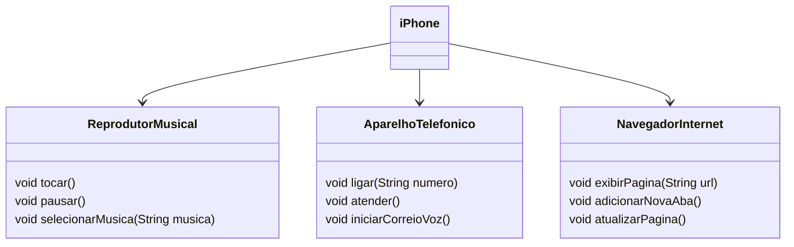

# DIO- Santander Bootcamp Fullstack Java+Angular

#### Autores
- [Gleyson Sampaio](https://github.com/glysns)

## Modelagem e Diagramação de um Componente iPhone  - Desafio (POO Básico)

Modelar e diagramar a representação UML do componente iPhone, elaborando a diagramação das classes e interfaces utilizando uma ferramenta UML, abrangendo suas funcionalidades como Reprodutor Musical, Aparelho Telefônico e Navegador na Internet, depois fazer a implementação em Java.

Criado na sintaxe [Mermaid](https://mermaid.js.org/)

###  Diagrama UML (Mermaid)

2. Implementar as classes e interfaces correspondentes em Java.

 

